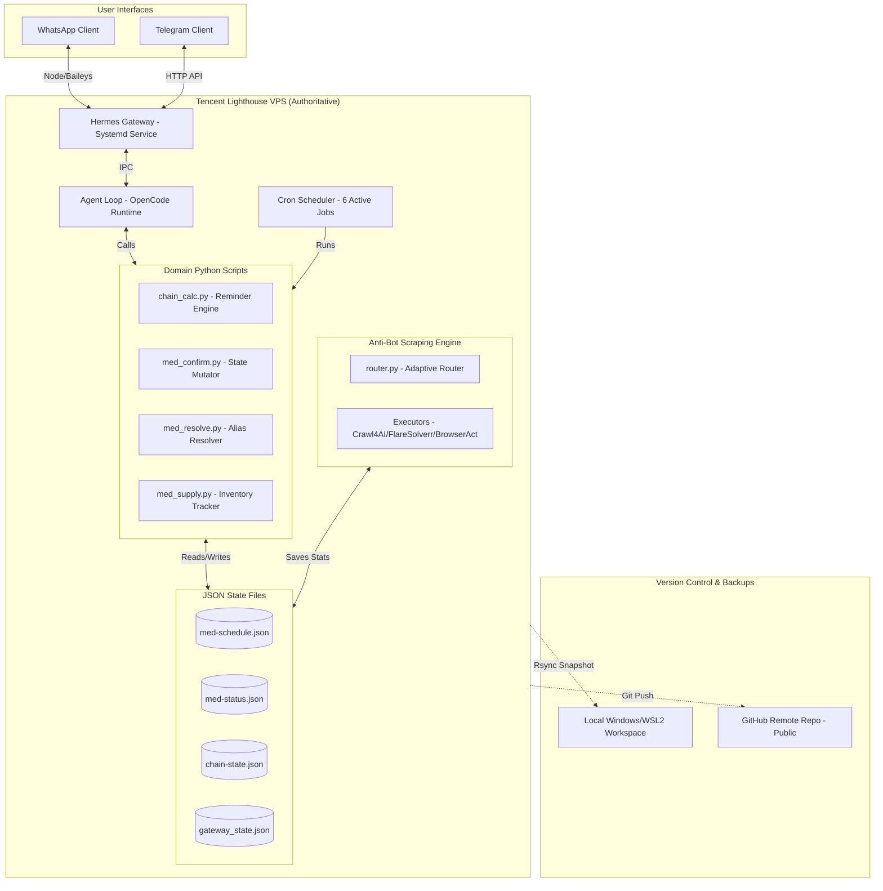

# audit-01 — System Context & Architecture Atlas (Hermes Agent / MJ)

> **Auditor:** OpenCode (External Executor/Auditor)
> **Date:** 2026-07-09
> **Status:** Live Audited & Verified
> **Authority:** Live VPS `ubuntu@119.28.119.151` (~/.hermes/), VPS snapshot 2026-07-09, and local workspace directories.
> **Scope:** Verification of all system-level configurations, cron loops, database states, codebase dependencies, case-sensitivity quirks, and cross-platform sync issues.

---

## 1. System Overview & Platform Topology

The Hermes Agent system (MarryJane / MJ) is not a simple medication tracker. It is a self-hosted, persistent agentic gateway bridging instant messaging platforms (WhatsApp + Telegram) to an LLM reasoning loop. It manages medication reminder states, user confirmations, automated diagnostics, and a secondary "anti-bot crawling engine" in parallel.

The authoritative state resides on one **Tencent SG VPS (ubuntu@119.28.119.151)**. A copy exists on the local Windows/WSL2 environment, and a public repository on GitHub tracks code updates.

### Topology Diagram (Verified)

---

## 2. Actual vs. Should Architecture Analysis

| Architectural Component | Should Design (Ideal Target) | Actual State (Verified Live) | Gaps & Technical Debt |
|---|---|---|---|
| **System Prompt (SOUL)** | Single system prompt containing both identity core and operational protocols. | Two separate files exist: uppercase [SOUL.md](file:///home/ubuntu/.hermes/SOUL.md) (10.7KB) and lowercase [soul.md](file:///home/ubuntu/.hermes/soul.md) (20.6KB). | **CRITICAL Case-Sensitivity Bug:** The prompt builder loads `SOUL.md` (uppercase) only. The system-level operational protocols added to `soul.md` (lowercase) on July 8th are completely ignored. |
| **Medication Timing Logic** | Deterministic constraint engine (`rules.json` and a solver) with clinical safety bounds. | Semi-heuristic logic in [chain_calc.py](file:///home/ubuntu/.hermes/scripts/chain_calc.py) interfacing with LLM context. | **Clinical Safety Gap:** Spec v3 is designed but unbuilt. Gaps: (a) blind shifts on Late A, (b) omission of 1h empty-stomach rule, (c) lack of independent Dexa schedules. |
| **Runtime Configuration** | Configured runtime files versioned and tracked by git. | Recent July 9 fixes to `models.py` and `run.py` live as uncommitted changes on VPS. | **Reproducibility Gap:** Local machine or fresh git clone will lack the 9/7 config improvements. |
| **State Modifications** | Atomic, transaction-backed writes with error recovery. | Non-atomic file open writes (`open('w')`) without file-replace locks. | **Data Corruption Risk:** Interruptions (OOM/crashing) mid-write can truncate `chain-state.json`, resetting cooldowns. |
| **Environment Sync** | Clean bidirectional synchronization between VPS, WSL, and Git. | Multi-way drift: Git is stale, Windows snapshot contains active `.env` secrets, VPS contains uncommitted code. | **Security / Version Drift:** Secrets are exposed in Windows snapshots; VPS changes are untracked. |

---

## 3. Data Flow & State Operations

1. **Incoming Signal:** User sends "done dexa" via WhatsApp/Telegram.
2. **Gateway Parsing:** The gateway checks `gateway_state.json` to confirm it is active, and passes the string to `run_agent.py`.
3. **Prompt Builder (Identity Injection):** Loads `SOUL.md` (uppercase) from `~/.hermes/` to construct the prompt context.
4. **Resolution Check:** The agent triggers `med_resolve.py` to match "dexa" against `med-schedule.json` aliases and current clock time.
5. **State Mutation:** If verified, the agent executes `med_confirm.py` to write the intake time to `med-status.json` and decrement supply in `med-supply.json`.
6. **Domino Calculus:** The cron job `chain_monitor.sh` fires every 15 minutes, calling `chain_calc.py` to evaluate intervals and output upcoming warnings.

---

## 4. Chronological Timeline of System Shifts (Jul 7 - Jul 9)

- **July 7:**
  - Standard baseline snapshot generated.
  - Active cron jobs: 14.
  - Model config: `deepseek-v4-pro` (expensive).
- **July 8:**
  - User updates lowercase `soul.md` on VPS with operational protocols. Prompt builder continues reading uppercase `SOUL.md`.
  - Cron cleanup: 8 jobs (including `hello-world-watch`) disabled in `jobs.json` to optimize CPU/tokens. Active cron count drops to 6.
- **July 9:**
  - Config changes live on VPS (hy3-free model default, fallback providers, run.py warnings) but left uncommitted.
  - Pharmacy medication swap: Akurit-4 swapped for Akurit-2; Pyridoxine substituted by Swisse B-Complex.
  - Separate crawler workstream commits (7 commits on `hermes-live` branch) added to `fetcher/` subdirectory.

---

## 5. The Anti-Bot Scraper Workstream

The codebase on branch `hermes-live` under `~/mjay/` contains a separate, highly sophisticated integration: an anti-bot data acquisition engine.
- **Core Architecture:**
  - `fetcher/router.py`: Adaptive capability-based executor routing.
  - `fetcher/cost_optimizer.py` and `fetcher/analytics.py`: Tracks scraping cost/performance in SQLite database.
  - `fetcher/executors/`: Contains `Crawl4AI`, `FlareSolverr`, and `BrowserAct` implementations.
- **Integration Boundary:** This engine stores cookies and runtime data in `~/.hermes/fetcher/` but code files are stored in `~/mjay/`. It represents useful commercial IP, completely separate from the medication assistant, but is subject to the same multi-way source-of-truth drift.
