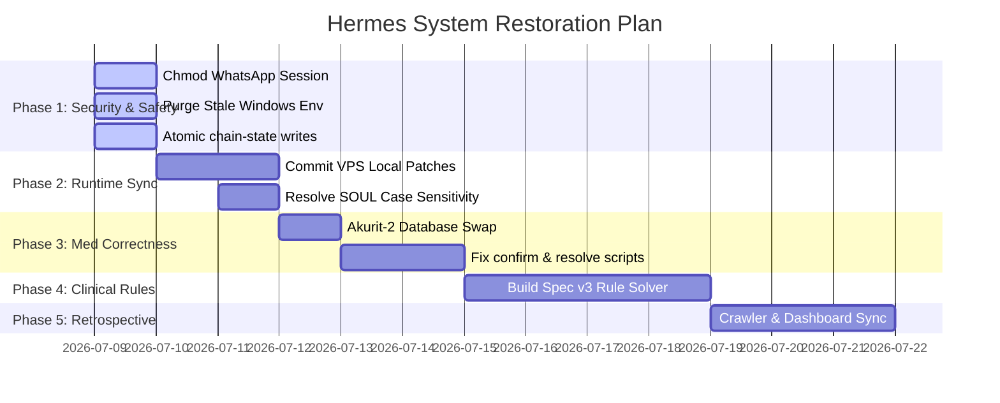

# audit-03 — Execution Plan (Hermes Agent / MJ)

> **Auditor:** OpenCode (External Executor/Auditor)
> **Date:** 2026-07-09
> **Goal:** High-efficiency, safety-first remediation plan aligning with ADHD compensation and side-income goals.
> **Safety Rule:** No VPS edits will be made without explicit user approval. All medication scripts must be tested using `--dry-run` first. No git commits/pushes without separate approval.

---

## 1. Guiding Strategy

The root cause of the system's runtime fragility is the lack of a **single, secret-safe, version-controlled source of truth**. Changes are made on the VPS, snapshots are taken manually, and GitHub remains stale.
Our strategy prioritizes securing credentials, establishing a reproducible repository, repairing data integrity bugs, and then building clinical and scraping features.

---

## 2. Phased Roadmap

---

## 3. Phase Details & Action Items

### Phase 1 — Security & Immediate Safety (Quick Wins)
*Target: Seal credential leaks and prevent state corruption.*

1. **Secure WhatsApp Session Folder:**
   - **Command:** `chmod 700 ~/.hermes/whatsapp/session && chmod 711 ~/.hermes/whatsapp` on VPS.
   - **Verification:** Run `ls -ld ~/.hermes/whatsapp/session` and confirm it reads `drwx------`.
2. **Purge Stale Local Credentials:**
   - **Action:** Delete `F:\AI Prep\OVIS\Hermes Agent\hermes-snapshot-20260707\.env` and ensure all local `.env` files are in `.gitignore`.
3. **Atomic `chain-state.json` Writer:**
   - **Action:** Modify `chain_calc.py` to write to `chain-state.json.tmp` first, then run `os.replace('chain-state.json.tmp', 'chain-state.json')`. If loading fails due to corruption, fallback to loading `chain-state.json.bak1` and throw a loud warning.

---

### Phase 2 — Runtime Sync & Prompt Repair (Reproducibility)
*Target: Establish Git as the source of truth and fix case-sensitivity bugs.*

1. **Commit VPS Core Edits:**
   - **Action:** Stage and commit VPS patches to `models.py` and `run.py` to branch `hermes-live`.
2. **Fix Case-Sensitivity Prompt Builder Bug:**
   - **Option A (Recommended):** Update `agent/prompt_builder.py` line 1810 to read lowercase `soul.md` and delete the older uppercase `SOUL.md` entirely to prevent future confusion.
   - **Option B:** Merge the contents of lowercase `soul.md` into uppercase `SOUL.md` and keep uppercase.
3. **Automate VPS-to-Git Backups:**
   - **Action:** Set up a cron task on VPS that runs `git status` check, alerts on uncommitted edits, and pushes clean files (excluding state JSONs, logs, and database secrets) to GitHub.

---

### Phase 3 — Medication Swaps & Script Corrections (Data Integrity)
*Target: Sync database with real-world intake and fix script calculation bugs.*

1. **Reflect Akurit-2 Swap:**
   - **Action:** Rename `akurit_4` -> `akurit_2` and `Akurit-4` -> `Akurit-2` across `med-schedule.json`, `med-status.json`, `med-supply.json`, and all referencing scripts.
   - **Action:** Update Slot A to substitute Pyridoxine with Swisse B-Complex, noting its food-intake guidelines.
2. **Fix Clobber & Double-Decrement Bugs in `med_confirm.py`:**
   - **Action:** Modify `confirm_slot` and `confirm_drug` to verify if a drug status is already `"taken"`. Only write time and decrement supply on a pending-to-taken transition.
3. **Fix Time Conversion in `med_resolve.py`:**
   - **Action:** Replace `float(time_24h.replace(":", "..."))` with integer-based division: `h, m = map(int, time_24h.split(':')); hour_f = h + m / 60.0`.
   - **Action:** Fix boundaries for time slots to prevent overlapping intervals.

---

### Phase 4 — Clinical Intelligence (Spec v3 implementation)
*Target: Shift timing logic from heuristic LLM context to a deterministic engine.*

1. **Build Deterministic Constraint Solver:**
   - **Action:** Implement `scripts/med_chain/solve.py` to calculate drug schedule schedules based on:
     - **Constraint A:** Akurit-2 empty stomach wait (~1h before other drugs/food).
     - **Constraint B:** Independent Dexamethasone timing (4h min gaps, keeping morning/noon/afternoon limits).
     - **Constraint C:** strict 12h gap invariant for Levetiracetam (Keppra).
2. **Add Explainability API:**
   - **Action:** Build `why.py` to output the exact constraints active at any time so the user understands why a schedule shifted.

---

### Phase 5 — Scraper Workstream & Commercialization
*Target: Leverage the system as a product.*

1. **Verify Overnight Build Automation:**
   - **Action:** Update the null script reference in `jobs.json` to call `build_overnight.py`.
2. **Fetcher Packaging:**
   - **Action:** Clean up `fetcher/` database writes to ensure cookies/statistics database locations are relative to environment paths, allowing it to be bundled as a separate anti-bot data scraping package.
3. **ADHD Dashboards:**
   - **Action:** Build a lightweight HTML dashboard displaying real-time compliance metrics, inventory status, and countdowns.
